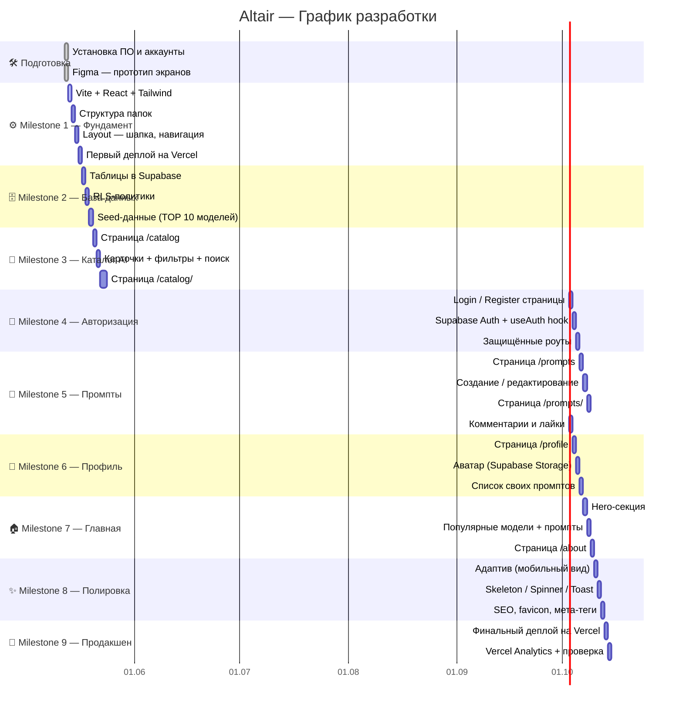

# Altair — Дорожная карта проекта

---

## Сводка по этапам

| # | Milestone | Длительность | Ключевой результат |
|---|---|---|---|
| 0 | Подготовка | ✅ Готово | Среда настроена |
| 1 | Фундамент | 4 дня | Работающий скелет на Vercel |
| 2 | База данных | 3 дня | Все таблицы и данные в Supabase |
| 3 | Каталог AI | 4 дня | Рабочий каталог с карточками |
| 4 | Авторизация | 3 дня | Вход и регистрация работают |
| 5 | Промпты | 4 дня | Полная библиотека промптов |
| 6 | Профиль | 3 дня | Личный кабинет пользователя |
| 7 | Главная | 3 дня | Главная страница и About |
| 8 | Полировка | 3 дня | Адаптив, анимации, SEO |
| 9 | Деплой | 2 дня | Продакшен-версия готова |

**Итого: ~3 недели**
